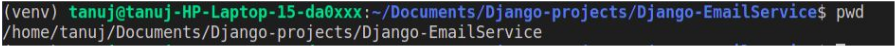
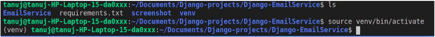
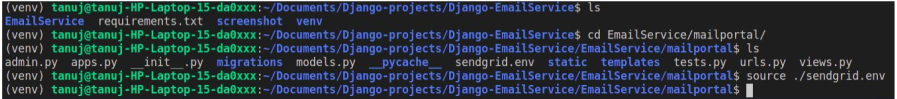
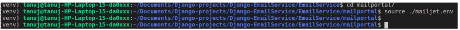
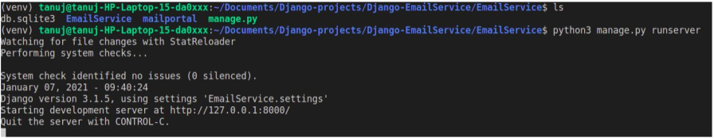
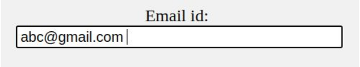
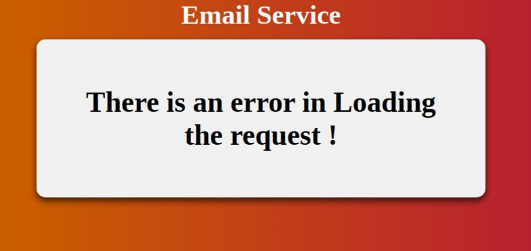
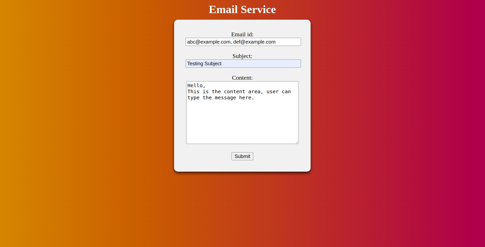
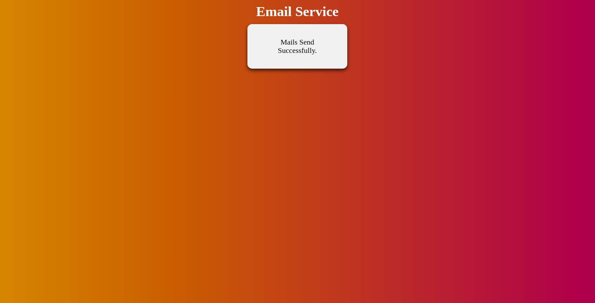

# Django-EmailService

APIs used in the Project :
1. Sendgrid Email Delivery Service
2. Mailjet Email Delivery Service

Setting the Virtual Environment & Environment variable:

Step 1: Turn On the virtual Environment (venv)

● Open the Terminal

● Change the working directory to “Django-EmailService”

● To verify the directory - $ pwd , You will see something like this :

● Now we have to activate the virtual environment named “venv”

● To activate it type the below command in the terminal :

  $ source venv/bin/activate  

Step 2: Setting the Environment variable for Sendgrid:

● Go inside the “EmailService/mailportal/”

● Run the below command to set the environment variable:

$ source ./sendgrid.env
 

Step 3: Setting the Environment variable for mailjet:

● Run the below command to set the environment variable:

$ source ./mailjet.env

Now let’s move on to running the Application :

1. Change the working directory to “EmailService”

2. The EmailService contains a “manage.py” file.

3. To run the server, type the below command on the terminal.

$ python3 manage.py runserver

4. The server is up and running.

5. Open any browser (preferred chrome & firefox)

6. And type -> ​ http://127.0.0.1:8000/

7. Input for the Email id:

8. If there is a single mail id:- no special care is needed.

9. If there are multiple mail ids:- mail ids should be separated bycomma(“,”).

10. Fill the complete form and Enter Submit.

11. If the request was a success then the message is displayed on the Screen

12. If the request gets failed, It displays the following message.

Screenshots of the Project :

Screenshot of the HOME Page

Screenshot of the Result

